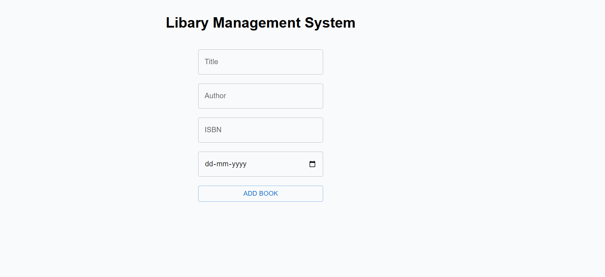
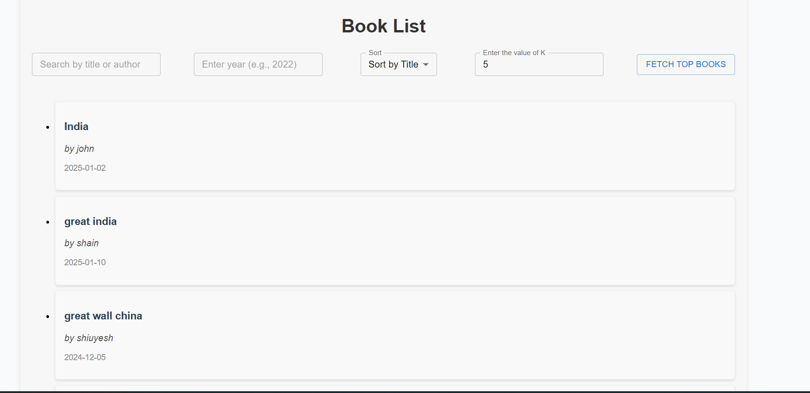

# Library Management Platform

## Add Books page

## Books page

Description:
This project demonstrates my ability to create a full-stack web application for managing a library system. The platform allows users to add books, browse available books, fetch,Search and sort any books , and manage their library accounts.
I implemented book management, and a seamless user interface to provide an engaging and easy-to-use experience.

Tools Used:
React
Node.js
Express.js
SQL
PostgreSQL
